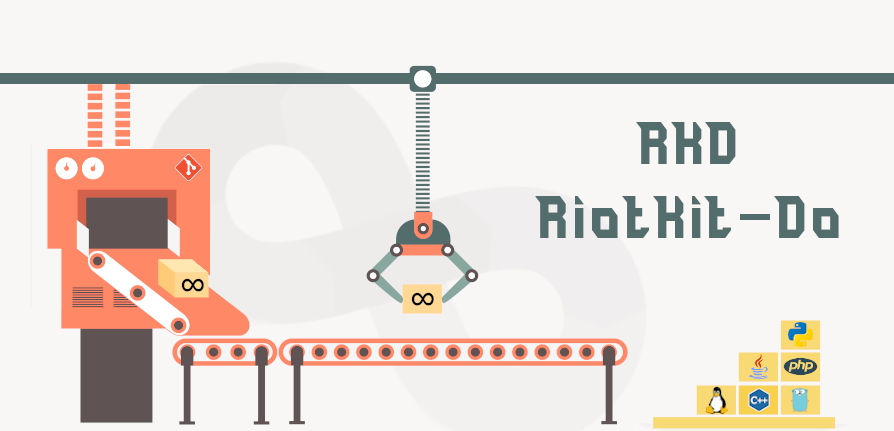
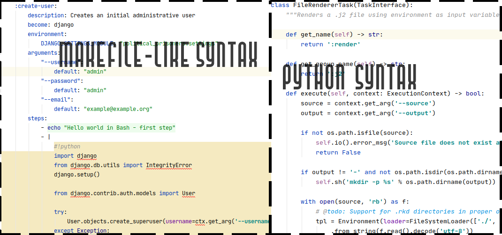
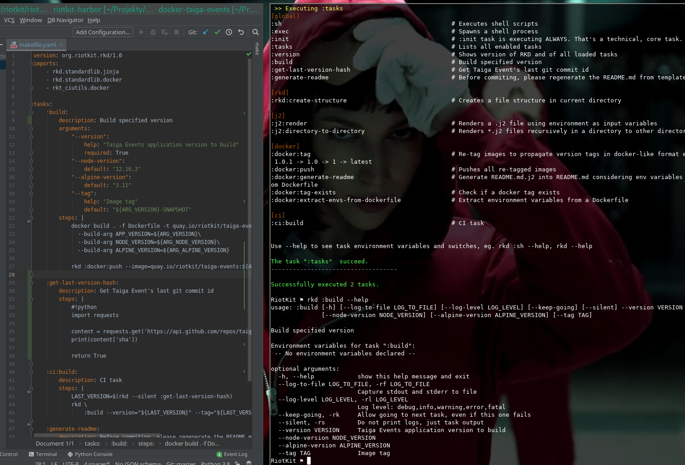

RKD - RiotKit-Do
================

.. image:: http://www.repostatus.org/badges/latest/active.svg
	:alt: Project Status: Active – The project has reached a stable, usable state and is being actively developed.
	:target: http://www.repostatus.org/#active

.. PyPI version — https://badge.fury.io/py/

.. image:: https://img.shields.io/github/v/release/riotkit-org/riotkit-do?include_prereleases
	:target: https://img.shields.io/github/v/release/riotkit-org/riotkit-do?include_prereleases
	:alt: Github Release

.. image:: https://img.shields.io/badge/Made%20with-Python-1f425f.svg
	:target: https://img.shields.io/badge/Made%20with-Python-1f425f.svg
	:alt: Made with Python
    
.. image:: https://img.shields.io/pypi/l/rkd.svg
	:target: https://img.shields.io/pypi/l/rkd.svg
	:alt: License

.. image:: https://github.com/riotkit-org/riotkit-do/workflows/Test%20and%20release%20a%20package/badge.svg
	:target: https://github.com/riotkit-org/riotkit-do/actions?query=workflow%3A%22Test+and+release+a+package%22
	:alt: Test and release a package
    
.. image:: https://img.shields.io/badge/PRs-welcome-brightgreen.svg?style=flat-square
	:target: https://img.shields.io/badge/PRs-welcome-brightgreen.svg?style=flat-square
	:alt: PRs welcome
    
.. image:: https://img.shields.io/github/issues-pr/riotkit-org/riotkit-do.svg
	:target: https://img.shields.io/github/issues-pr/riotkit-org/riotkit-do.svg
	:alt: PRs open

.. image:: https://img.shields.io/github/issues/riotkit-org/riotkit-do.svg
	:target: https://img.shields.io/github/issues/riotkit-org/riotkit-do.svg
	:alt: Issues open

Task executor - balance between Makefile and Gradle [see documentation_], designed with :heart:   by RiotKit for DevOps.
------------------------------------------------------------------------------------------------------------------------

*Easiest and cleanest way to write management scripts and share them between projects, teams and even organizations*

RKD is a stable, open-source, multi-purpose automation tool which balance flexibility with simplicity. The primary language is Python
and YAML syntax.

RiotKit-Do can be compared to **Gradle** and to **GNU Make**, by allowing both Python and Makefile-like YAML syntax.

**Can be used on PRODUCTION, for development, for testing, to replace some of Bash scripts inside docker containers,
and for many more, where Makefile was used.**

It is not a build tool for Java, but more a DevOps multi-purpose tool. At this time it will not replace Gradle,
but maybe in the future this can be achieved by building community packages with support for building eg. Java applications.

Example use cases
~~~~~~~~~~~~~~~~~

- `Docker based production environment <https://github.com/riotkit-org/riotkit-harbor>`_ with multiple configuration files, procedures
- Database administrator workspace (importing dumps, creating new user accounts, plugging/unplugging databases)
- Development environment (executing migrations, importing test database, splitting tests and running parallel)
- On CI (prepare project to run on eg. Jenkins or Gitlab CI) - RKD is reproducible on local computer which makes inspection easier
- `Kubernetes/OKD deployment workspace <https://github.com/riotkit-org/riotkit-do-example-kubernetes-workspace>`_ (create shared YAML parts with JINJA2 between multiple environments and deploy from RKD)
- Automate things like certificate regeneration on production server, RKD can generate any application configs using JINJA2
- `Installers <https://riotkit-do.readthedocs.io/en/latest/usage/wizard.html>`_ (RKD has built-in commands for replacing lines in files, modifying .env files)

Quick start
~~~~~~~~~~~

.. code:: bash

    # 1) via PIP
    pip install rkd

    # 2) Create project (will create a virtual env and prepare files that could be commited to git)
    rkd :rkd:create-structure

Please check available releases there: https://pypi.org/project/rkd/#history

**Goals:**

- Define tasks as simple as in Makefile
- Write tasks code in Python as simple as possible
- Reuse code as simple as in Gradle (using extensions that provides tasks. Extensions are installable from PIP)
- Simple configuration in Python
- Integrates with GIT
- Suitable for PRODUCTION (log as much as possible, log each executed task into separated \*.log files). We planned also extended logging of most important auditing information such as who executed action, and how the state looked in that time

Rules
-----

-  No hooks eg. task.executeAfter(otherTask), no complex dependencies
-  No in-memory state between tasks. State could be only changed in files/database/kv-store like it is in other build systems
-  No dynamic tasks names eg. by turning on Publish component it should
   not create tasks eg. :publishIWAToDockerRegistry (where IWA is the project name)
-  Don't pack too many features into the core, do this in external modules. Keep the RKD core clean!
-  Full static analysis, you can work on makefile.py and on task's code in PyCharm with full code completion!
-  Do early validation. Runtime validation for long running builds is a pain-in-the-ass for the user.
-  Show clear error messages as much as it is possible. Task not found? Tell the user - do not leave a stack trace. Import error in makefile.py? Tell the user + add stack trace. RESPECT TIME OF ALL OF US! :)
-  Do not overuse libraries in RKD core - it must be installable in any environment, including Docker. Libraries count should be small, and the libraries cannot depend on GCC/G++

RKD in action
-------------

YAML syntax example
~~~~~~~~~~~~~~~~~~~

Python syntax example (makefile.py)
~~~~~~~~~~~~~~~~~~~~~~~~~~~~~~~~~~~

.. image:: ./docs/makefile.png

Documentation
-------------

Please read the documentation_ here_.

.. _documentation: https://riotkit-do.readthedocs.io/en/latest/
.. _here: https://riotkit-do.readthedocs.io/en/latest/

Roadmap
-------

Check our github milestones_, to see what's actually planned for next releases.

.. _milestones: https://github.com/riotkit-org/riotkit-do/milestones

Projects using RKD
------------------

- `Taiga - automatic packaging into PRODUCTION docker image <https://github.com/riotkit-org/docker-taiga>`_
- `Taiga Events - automatic packaging into PRODUCTION docker image <https://github.com/riotkit-org/docker-taiga-events>`_
- `RiotKit Harbor (upcoming 2.0 version uses RKD) - Automated docker-compose PRODUCTION environment with Service Discovery, automatic SSL, rolling deployments and more! <https://github.com/riotkit-org/riotkit-harbor>`_
- `Harbor Simple Router - NGINX image with predefined templates, controlled by environment variables <https://github.com/riotkit-org/harbor-simple-router>`_
- `Kubernetes/OKD workspace - create deployments with reusable YAMLs <https://github.com/riotkit-org/riotkit-do-example-kubernetes-workspace>`_

Alternative ways of installation
--------------------------------

- `Arch Linux AUR package <https://aur.archlinux.org/packages/riotkit-do/>`_ `made by ragouel <https://github.com/ragouel>`_

Releasing
---------

1. Create a release in Github releases
2. Wait for pipeline to build and publish to PyPI

From authors
------------

We are grassroot activists for social change, so we created RKD especially in mind for those fantastic initiatives:

- RiotKit (https://riotkit.org)
- International Workers Association (https://iwa-ait.org)
- Anarchistyczne FAQ (http://anarchizm.info) a translation of Anarchist FAQ (https://theanarchistlibrary.org/library/the-anarchist-faq-editorial-collective-an-anarchist-faq)
- Federacja Anarchistyczna (http://federacja-anarchistyczna.pl)
- Związek Syndykalistów Polski (https://zsp.net.pl) (Polish section of IWA-AIT)
- Komitet Obrony Praw Lokatorów (https://lokatorzy.info.pl)
- Solidarity Federation (https://solfed.org.uk)
- Priama Akcia (https://priamaakcia.sk)

Special thanks to `Working Class History <https://twitter.com/wrkclasshistory>`_ for very powerful samples that we could use in our unit tests.
