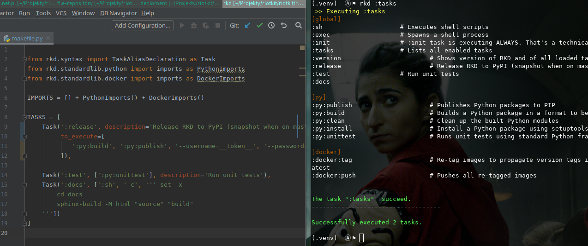

RKD - RiotKit DO
================

.. image:: https://api.travis-ci.com/riotkit-org/riotkit-do.svg?branch=master

Task executor - balance between Makefile and Gradle [see documentation_]

.. code:: bash

    # via PIP
    pip install rkd

    # via PIPENV
    pipenv install rkd

Please check available releases there: https://pypi.org/project/rkd/#history

NOTICE: This project is in testing stage. There is no stable release yet, but it will come very soon. The API can change in upcoming days.

**Goals:**

- Define tasks as simple as in Makefile
- Reuse code as simple as in Gradle (using extensions that provides tasks. Extensions are installable from PIP)
- Simple configuration in Python
- Write tasks code in Python as simple as possible

Rules
-----

-  No hooks eg. task.executeAfter(otherTask), no complex dependencies
-  No dynamic tasks names eg. by turning on Publish component it should
   not create tasks eg. :publishIWAToDockerRegistry (where IWA is the
   project name)
-  Don't pack too many features into the core, do this in external modules. Keep the RKD core clean!
-  Full static analysis, you can work on makefile.py and on task's code in PyCharm with full code completion!
-  Do early validation. Runtime validation for long running builds is a pain-in-the-ass for the user.
-  Show clear error messages as much as it is possible. Task not found? Tell the user - do not leave a stack trace. Import error in makefile.py? Tell the user + add stack trace. RESPECT TIME OF ALL OF US! :)

Documentation
-------------

Please read the documentation_ here_.

.. _documentation: https://riotkit-do.readthedocs.io/en/latest/
.. _here: https://riotkit-do.readthedocs.io/en/latest/

From authors
------------

We are grassroot activists for social change, so we created RKD especially in mind for those fantastic initiatives:

- RiotKit (https://riotkit.org)
- International Workers Association (https://iwa-ait.org)
- Anarchistyczne FAQ (http://anarchizm.info) a translation of Anarchist FAQ (https://theanarchistlibrary.org/library/the-anarchist-faq-editorial-collective-an-anarchist-faq)
- Federacja Anarchistyczna (http://federacja-anarchistyczna.pl)
- Związek Syndykalistów Polski (https://zsp.net.pl) (Polish section of IWA-AIT)
- Komitet Obrony Praw Lokatorów (https://lokatorzy.info.pl)
- Solidarity Federation (https://solfed.org.uk)
- Priama Akcia (https://priamaakcia.sk)

Special thanks to `Working Class History <https://twitter.com/wrkclasshistory>`_ for very powerful samples that we could use in our unit tests.
