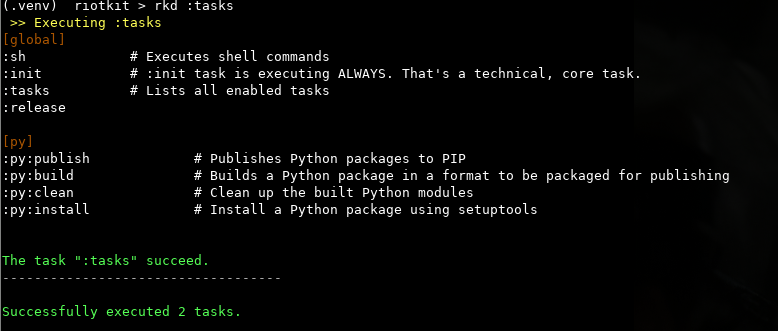

Riotkit Do (RKD)
================

RKD is delivered as a Python Package. To extend RKD with additional tasks you need to install them via PIP or (simpler) define in makefile.py/makefile.yaml

Bootstrap RKD in your project
-----------------------------

The preferred way to setup RKD is virtualenv.

With requirements.txt and virtualenv you can fully control versioning of RKD and it's components provided by open-source community. You decide when you are ready to upgrade.

.. code:: bash

    virtualenv .venv
    source .venv/bin/activate

    echo "rkd<=0.5" > requirements.txt # better choose a stable tag and use fixed version for stability

    # example of installing component from external package/repository
    # later you need to activate it in makefile.yaml or in makefile.py - check later other chapter "Importing tasks"
    # echo "rkt_ciutils<=3.0"

    pip install -r requirements.txt
    rkd :rkd:create-structure

Conception
----------

Makefile, Gradle and other build systems are strictly for development, so RiotKit decided to create RKD **with DevOps in mind**.

Everything could be done like in Makefile via YAML syntax, or in Python, because DevOps love Python! :)

In effect a simple task executor with clear rules and early validation of input parameters was created.
Each task specified to be run is treated like a separate application - has it's own parameters, by default inherits global settings but those could be overridden.
**The RKD version and version of any installed tasks are managed by Python Packaging - DevOps needs to have strict control over dependencies and upgrades.**

**Basic examples:**

.. code:: bash

    rkd :tasks

    # runs two tasks ":sh" with different arguments
    rkd :sh -c 'echo hello' :sh -c 'ps aux'

    # runs different tasks in order
    rkd :py:clean :py:build :py:publish --user=__token__ --password=123456

    # allows to fail one of tasks in our pipeline (does not interrupt the pipeline when first task fails)
    rkd :sh -c 'exit 1' --keep-going :sh -c 'echo hello'

    # silent output, only tasks stdout and stderr is visible (for parsing outputs in scripts)
    rkd --silent :sh -c "ps aux"

.. image:: ../python.png

.. toctree::
   :maxdepth: 5
   :caption: Contents:

   quickstart
   standardlib/index
   usage/index

