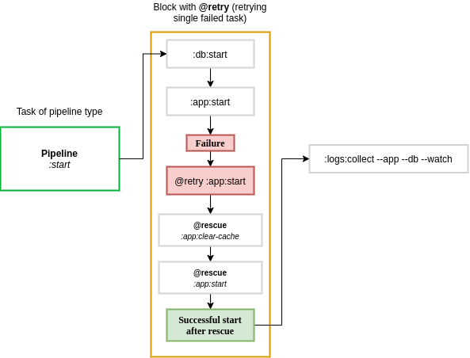
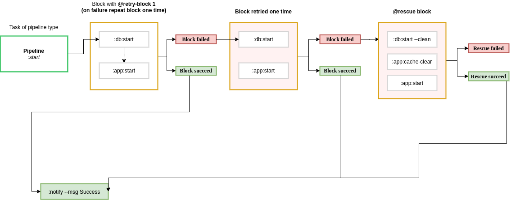
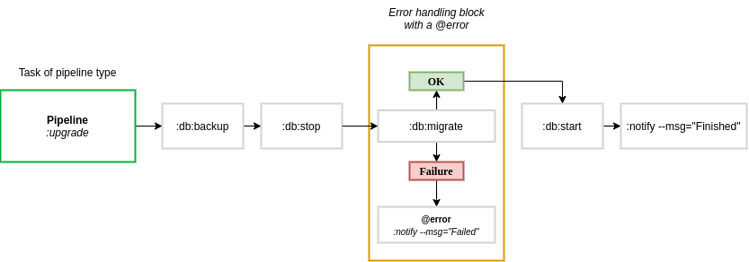
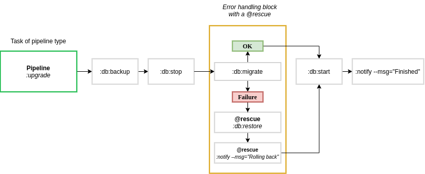

Pipelines
=========

    Pipeline is a set of Tasks executing in selected order, with optional addition of error handling.
    Modifiers are changing behavior of Task execution, by implementing fallbacks, retries and error notifications.

.. TIP::

    Modifiers can be used together e.g. **@retry** + **@rescue**, **@retry** + **@error**

Basic pipeline
--------------

Basically the pipeline is a set of Tasks, it does not need to define any error handling.

.. TIP::

    Treat Pipeline as a shell command invocation - in practice a Pipeline is an alias, it is similar to a command executed in command line but a little bit more advanced.

    The comparison isn't abstract, that's how Pipelines works and why there are shell examples of Pipelines.

.. tabs::

   .. tab:: YAML

      .. code:: yaml

            version: org.riotkit.rkd/yaml/v2

            # ...

            pipelines:
                :perform:
                    tasks:
                        - task: :start
                        - task: :do-something
                        - task: :stop

   .. tab:: Python

      .. code:: python

            from rkd.core.api.syntax import Pipeline, PipelineTask as Task, PipelineBlock as Block, TaskDeclaration

            # ...

            PIPELINES = [
                Pipeline(
                    name=':perform',
                    description='Example',
                    to_execute=[
                        Task(':start'),
                        Task(':do-something'),
                        Task(':stop')
                    ]
                )
            ]

   .. tab:: Shell

      .. code:: bash

            # :perform
            ./rkdw :start :do-something :stop

@retry
------

Simplest modifier that retries each failed task in a block up to maximum of N times.

The example actually combines **@retry** + **@rescue**. But **@retry** can be used alone.

.. WARNING::

    When retrying a Pipeline inside of a Pipeline, then all that child Pipeline Tasks will be repeated,
    it will work like a @retry-block for inherited Pipeline.

**Syntax:**

.. tabs::

   .. tab:: YAML

      .. code:: yaml

            version: org.riotkit.rkd/yaml/v2

            # ...

            pipelines:
                :start:
                    tasks:
                        - block:
                              retry: 1  # retry max. 1 time
                              rescue: [':app:clear-cache', ':app:start']
                              tasks:
                                  - task: [':db:start']
                                  - task: [':app:start']
                        - task: [':logs:collect', '--app', '--db', '--watch']

   .. tab:: Python

      .. code:: python

            from rkd.core.api.syntax import Pipeline, PipelineTask as Task, PipelineBlock as Block, TaskDeclaration

            # ...

            PIPELINES = [
                Pipeline(
                    name=':start',
                    description='Example',
                    to_execute=[
                        Block(rescue=':app:clear-cache :app:start', retry=1, tasks=[
                            Task(':db:start'),
                            Task(':app:start')
                        ]),
                        Task(':logs:collect', '--app', '--db', '--watch')
                    ]
                )
            ]

   .. tab:: Shell

      .. code:: bash

            # :start
            ./rkdw '{@rescue :app:clear-cache :app:start @retry 1}' :db:start :app:start '{/@}' :logs:collect --app --db --watch

**Example workflow:**

@retry-block
------------

Works in similar way as **@retry**, the difference is that if at least one task fails in a block, then all tasks from that blocks are repeated N times.

**Example workflow:**

@error
------

Executes a Task or set of Tasks when error happens. Does not affect the final result. After error task is finished the whole execution is stopped, no any more task will execute.

**Syntax:**

.. tabs::

   .. tab:: YAML

      .. code:: yaml

            version: org.riotkit.rkd/yaml/v2

            # ...

            pipelines:
                :upgrade:
                    tasks:
                        - task: ":db:backup"
                        - task: ":db:stop"
                        - block:
                              error: [':notify', '--msg="Failed"']
                              tasks:
                                  - task: [':db:migrate']
                        - task: [":db:start"]
                        - task: [":notify", '--msg', 'Finished']

   .. tab:: Python

      .. code:: python

            from rkd.core.api.syntax import Pipeline, PipelineTask as Task, PipelineBlock as Block, TaskDeclaration
            from rkd.core.standardlib.core import DummyTask
            from rkd.core.standardlib.shell import ShellCommandTask

            # ...

            PIPELINES = [
                Pipeline(
                    name=':upgrade',
                    description='Example',
                    to_execute=[
                        Task(':db:backup'),
                        Task(':db:stop'),
                        Block(error=':notify --msg="Failed"', tasks=[
                            Task(':db:migrate')
                        ]),
                        Task(':db:start'),
                        Task(':notify', '--msg', 'Finished')
                    ]
                )
            ]

   .. tab:: Shell

      .. code:: bash

            # :upgrade
            ./rkdw :db:backup :db:stop '{@error :notify --msg="Failed"}' :db:migrate '{/@}' :db:start :notify --msg "Finished"

**Example workflow:**

@rescue
-------

Defines a Task that should be ran, when any of Task from given block will fail.
Works similar as **@error**, but with difference that **@rescue** changes the result of pipeline execution.

.. TIP::

    When **@rescue** succeeds, then we assume that original Task that failed is now ok.

.. WARNING::

    When rescuing a whole Pipeline inside other Pipeline, then failing Task will be rescued and the rest of Tasks
    from child Pipeline will be skipped.

**Example workflow:**

Order of modifiers execution
----------------------------

1. @retry: Each task is repeated until success or repeat limit
2. @retry-block: Whole block is repeated until success or repeat limit
3. @rescue: A rescue attempt of given Task or inherited Pipeline is attempted
4. @error: An error notification is sent, when all previous steps failed

Pipeline in Pipeline
--------------------

A Pipeline inside a Pipeline is when we have defined a Pipeline, and one of it's called Tasks is other Pipeline.

.. code:: yaml

    version: org.riotkit.rkd/yaml/v2

    # ...

    pipelines:
        :prepare_disk_space:
            tasks:
                - task: ":db:clear_buffers"
                - task: ":db:clear_temporary_directory"

        :upgrade:
            tasks:
                - task: ":db:backup"
                - task: ":db:stop"
                - task: ":prepare_disk_space"   # HERE IS OUR INHERITED PIPELINE
                - block:
                      error: [':notify', '--msg="Failed"']
                      tasks:
                          - task: [':db:migrate']
                - task: [":db:start"]
                - task: [":notify", '--msg', 'Finished']

Pipeline in Pipeline - how modifiers behave
-------------------------------------------

Having Pipeline called inside other Pipeline, the inherited one is treated similar to a Task.

.. code:: yaml

    :pipeline_1 (@retry, @error, @rescue)
        :task_1
        :pipeline_2 (@retry, @rescue, ...)
            :subtask_1
            :subtask_2
        :task_3

When :code:`:pipeline_2` fails then at first - `:pipeline_2` modifiers are called.
In case, when `:pipeline_2` modifiers didn't rescue the Pipeline, then modifiers from parent level :code:`:pipeline_1` are called.

.. WARNING::

    When modifiers on main level of Pipeline fails, then parent Pipeline modifiers are inherited that behaves differently.

    1. @retry from parent becomes a @retry-block of whole Pipeline (we retry a Pipeline now)
    2. @rescue after rescuing a Task inside child Pipeline is skipping remaining Tasks in child Pipeline

Python syntax reference (API)
-----------------------------

.. autoclass:: rkd.core.api.syntax.Pipeline

.. autoclass:: rkd.core.api.syntax.PipelineTask

.. autoclass:: rkd.core.api.syntax.PipelineBlock

